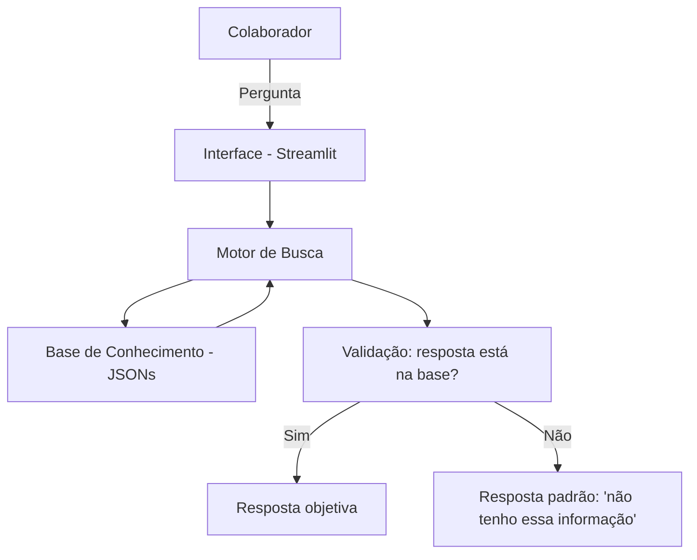

# Documentação do Agente

## Caso de Uso

### Problema
> Em empresas de todos os portes, grande parte das solicitações enviadas ao setor de Recursos Humanos corresponde a dúvidas recorrentes (férias, banco de horas, benefícios, licenças, políticas internas). Responder continuamente essas perguntas consome tempo da equipe de RH e atrasa atividades mais estratégicas.

### Solução
> O HR Assistant AI consulta uma base de conhecimento estruturada com perguntas e respostas de RH e responde ao colaborador de forma objetiva e padronizada. Quando a pergunta está fora do escopo da base, o agente informa que não possui informação suficiente e orienta o colaborador a procurar o RH diretamente, ao invés de arriscar uma resposta incorreta.

### Público-Alvo
> Colaboradores da empresa que têm dúvidas do dia a dia sobre férias, banco de horas, benefícios, licenças e políticas internas, além de gestores que queiram consultar essas mesmas informações rapidamente.

---

## Persona e Tom de Voz

### Nome do Agente
RH.IA

### Personalidade
> Objetivo e prestativo — vai direto ao ponto, sem enrolar, mas sempre educado. Não tenta parecer "engraçadinho"; é claro e confiável, como se fosse um colega experiente do RH.

### Tom de Comunicação
> Acessível e profissional. Nada de jargão jurídico/trabalhista complicado — explica de um jeito que qualquer colaborador entende, mesmo quem nunca leu a CLT.

### Exemplos de Linguagem
- Saudação: "Olá! Sou o RH.IA. Em que posso te ajudar hoje — férias, banco de horas, benefícios, licenças ou políticas internas?"
- Confirmação: "Entendi sua dúvida! Deixa eu consultar isso pra você."
- Erro/Limitação: "Não tenho essa informação na minha base de conhecimento no momento. Recomendo falar diretamente com o time de RH pra garantir uma resposta certa."

---

## Arquitetura

### Diagrama

### Componentes
| Componente | Descrição |
|------------|-----------|
| Interface | Chatbot em Streamlit |
| Motor de Busca | Script Python que localiza a pergunta mais próxima nos arquivos JSON |
| Base de Conhecimento | 5 arquivos JSON (férias, banco de horas, benefícios, licenças, políticas gerais) |
| Validação | Checagem se a pergunta bate com algo na base antes de responder |

---

## Segurança e Anti-Alucinação

### Estratégias Adotadas
- [x] O agente só responde com base nos dados da base de conhecimento
- [x] Quando não sabe, admite e orienta o colaborador a procurar o RH
- [x] Não responde perguntas fora do escopo de RH (ex: assuntos técnicos de outras áreas)
- [ ] Respostas incluem a categoria/fonte da informação

### Limitações Declaradas
> O agente não substitui o atendimento humano do RH em casos sensíveis (demissões, litígios, situações pessoais delicadas). Ele não acessa dados individuais reais de colaboradores (saldo real de férias, holerite, etc.) — trabalha apenas com informações gerais de política da empresa. Não deve ser usado para decisões jurídicas ou trabalhistas formais.
